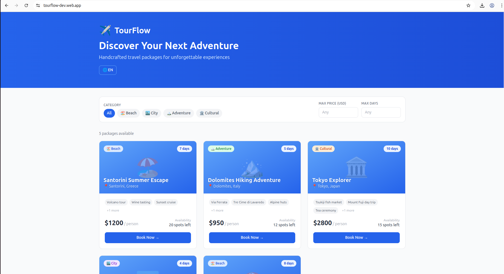
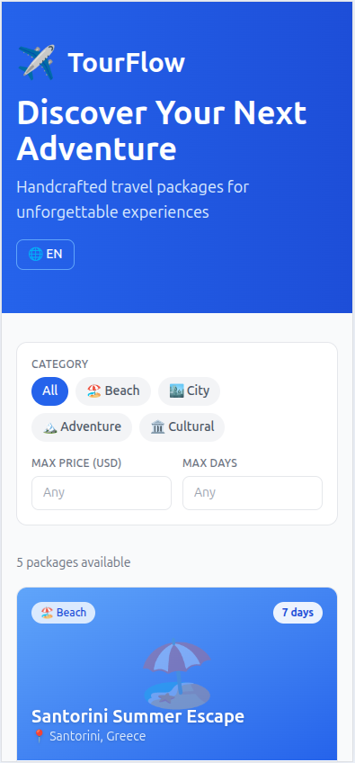
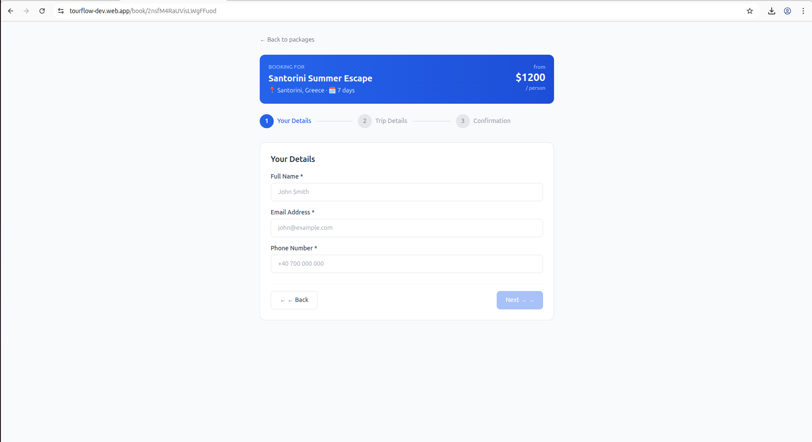
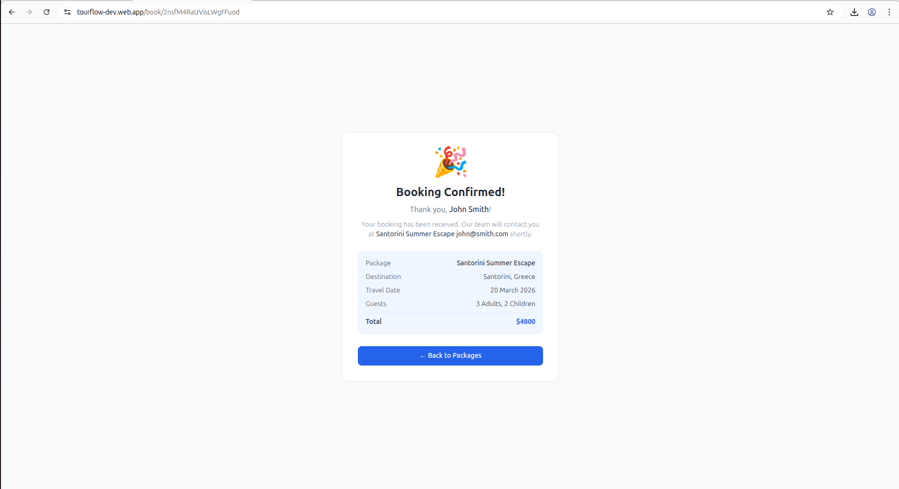
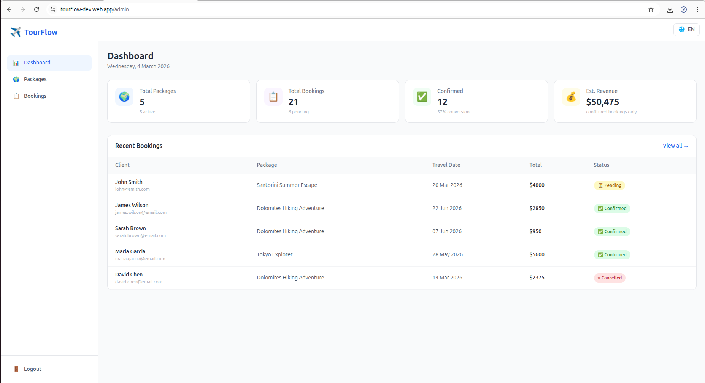
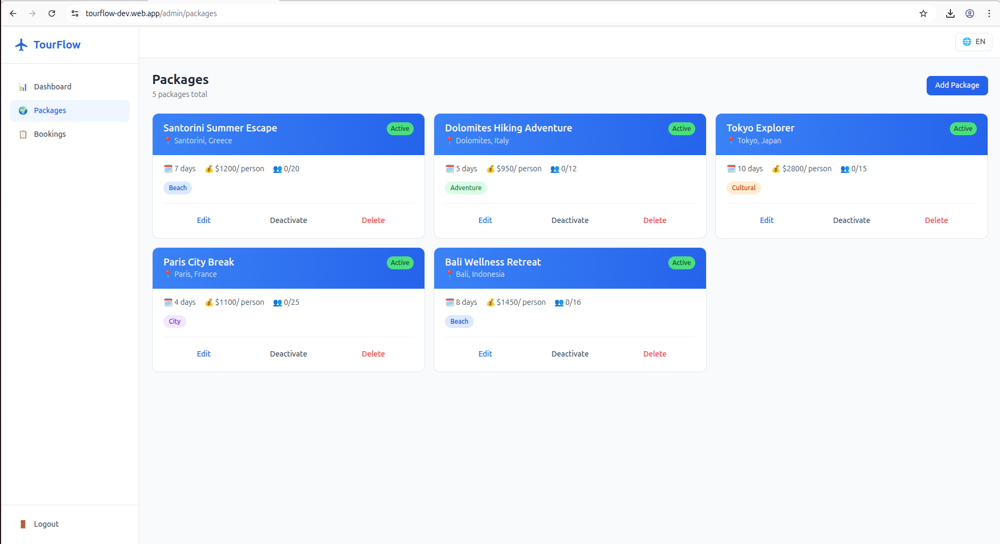
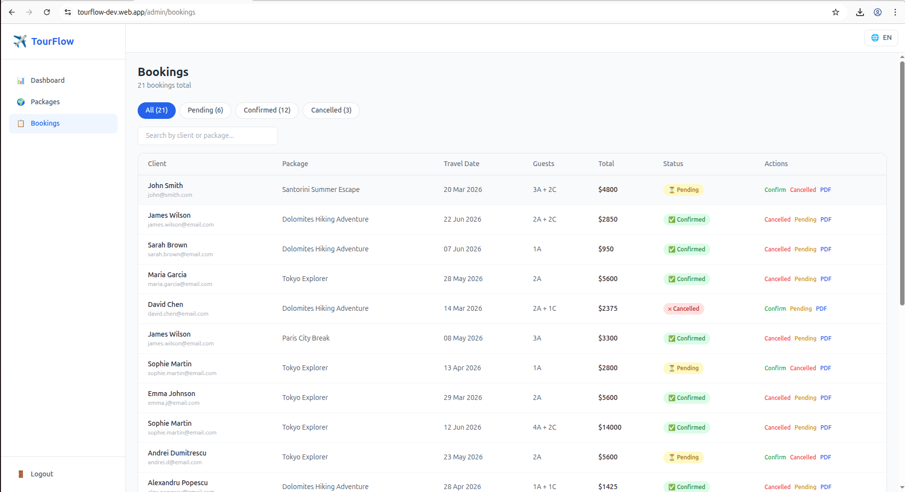
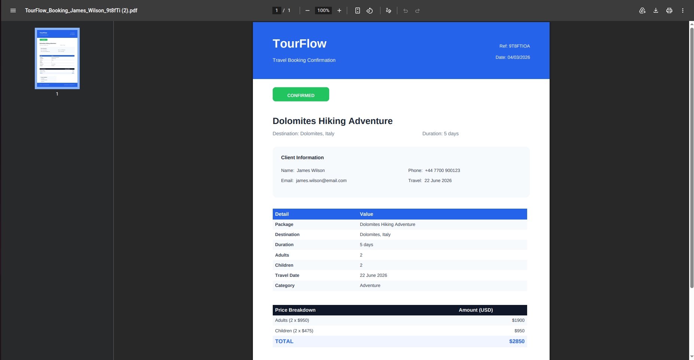

# ✈️ TourFlow — B2B2C Travel Booking Platform

[](https://tourflow-dev.web.app)
[](https://react.dev)
[](https://firebase.google.com)
[](https://tailwindcss.com)

A full-featured travel agency management platform built with React 18, Tailwind CSS v3, and Firebase. Designed for travel agencies to manage packages and bookings, with a public-facing portal for clients to browse and book trips — no account required.

---

## 🔐 Demo Access

TourFlow has two separate entry points — no registration needed for either:

| | URL | Credentials |
|---|---|---|
| **Public Portal** (client view) | [tourflow-dev.web.app](https://tourflow-dev.web.app) | No login required — browse and book freely |
| **Admin Panel** (agency view) | [tourflow-dev.web.app/admin/login](https://tourflow-dev.web.app/admin/login) | Email: `demo@tourflow.app` / Password: `Demo1234!` |

---

## 📸 Screenshots

<table>
  <tr>
    <td></td>
    <td></td>
  </tr>
  <tr>
    <td align="center"><b>Public Packages — Desktop</b></td>
    <td align="center"><b>Public Packages — Mobile</b></td>
  </tr>
  <tr>
    <td></td>
    <td></td>
  </tr>
  <tr>
    <td align="center"><b>Booking Form — 3-Step Flow</b></td>
    <td align="center"><b>Booking Confirmation Screen</b></td>
  </tr>
  <tr>
    <td></td>
    <td></td>
  </tr>
  <tr>
    <td align="center"><b>Admin Dashboard — KPI Cards</b></td>
    <td align="center"><b>Package Management — CRUD</b></td>
  </tr>
  <tr>
    <td></td>
    <td></td>
  </tr>
  <tr>
    <td align="center"><b>Bookings Management</b></td>
    <td align="center"><b>PDF Booking Confirmation</b></td>
  </tr>
</table>

---

## 🚀 Features

### Public Portal (Client-facing)
- **Package Listing** — Browse all available travel packages with category, price, and duration filters
- **Package Cards** — Destination, highlights, availability, price per person
- **3-Step Booking Form** — Personal details → Trip details → Confirmation, no account required
- **Booking Success Screen** — Full summary with all booking details
- **Bilingual RO/EN** — Language toggle persisted across sessions

### Admin Panel (Agency-facing)
- **Dashboard** — Real-time KPI cards: total packages, bookings, confirmed rate, estimated revenue
- **Recent Bookings** — Last 5 bookings at a glance with quick navigation
- **Package Management** — Full CRUD with itinerary builder (add/remove days), highlights, availability toggle
- **Booking Management** — Filter by status (pending/confirmed/cancelled), search by client or package
- **Status Actions** — Confirm, cancel, or reset booking status in one click
- **PDF Export** — Professional booking confirmation PDF with price breakdown, highlights, client info
- **Bilingual RO/EN** — Full i18n including PDF output

---

## 🛠 Tech Stack

| Layer | Technology |
|-------|-----------|
| Frontend | React 18 + Vite |
| Styling | Tailwind CSS v3 |
| Backend | Firebase Firestore (real-time) |
| Auth | Firebase Authentication |
| Hosting | Firebase Hosting |
| PDF | jsPDF + jspdf-autotable |
| Charts | Recharts |
| Routing | React Router v6 |

---

## 🗂 Project Structure

```
src/
├── components/
│   └── Layout.jsx          # Sidebar + Header with i18n toggle
├── hooks/
│   ├── useAuth.js           # Firebase auth state
│   └── useLanguage.js       # i18n singleton store (RO/EN)
├── lib/
│   └── firebase.js          # Firebase config + exports
├── pages/
│   ├── admin/
│   │   ├── LoginPage.jsx
│   │   ├── DashboardPage.jsx
│   │   ├── PackagesPage.jsx
│   │   └── BookingsPage.jsx
│   └── public/
│       ├── PublicPackagesPage.jsx
│       └── BookingFormPage.jsx
├── services/
│   ├── packagesService.js   # Firestore CRUD — packages
│   ├── bookingsService.js   # Firestore CRUD — bookings
│   └── pdfService.js        # PDF generation
scripts/
└── seed.js                  # Demo data: 5 packages + 20 bookings
```

---

## 🔥 Firebase Structure

```
packages/
  {packageId}
    name, destination, duration, price
    maxCapacity, currentBookings
    category, highlights[], itinerary[]
    available, createdAt

bookings/
  {bookingId}
    packageId, packageName
    clientName, clientEmail, clientPhone
    adults, children, travelDate
    totalPrice, status, notes, createdAt
```

---

## ⚙️ Local Development

```bash
# Clone the repository
git clone https://github.com/tudorsorinoltean/tourflow.git
cd tourflow

# Install dependencies
npm install

# Create .env file with your Firebase config
cp .env.example .env

# Start development server
npm run dev

# Seed demo data (optional)
node scripts/seed.js
```

### Environment Variables

```env
VITE_FIREBASE_API_KEY=your_api_key
VITE_FIREBASE_AUTH_DOMAIN=your_project.firebaseapp.com
VITE_FIREBASE_PROJECT_ID=your_project_id
VITE_FIREBASE_STORAGE_BUCKET=your_project.firebasestorage.app
VITE_FIREBASE_MESSAGING_SENDER_ID=your_sender_id
VITE_FIREBASE_APP_ID=your_app_id
```

---

## 📦 Deployment

```bash
npm run build
firebase deploy --only hosting
```

---

## 💼 Business Context

TourFlow was built as a portfolio project to demonstrate full-stack development skills combined with domain expertise in the travel industry.

**Target clients:** Travel agencies looking to digitize their package management and offer a modern booking experience to their clients.

**Value proposition:**
- Replace spreadsheets and email chains with a centralized booking system
- Give clients a professional self-service booking portal
- Generate branded PDF confirmations instantly
- Manage availability and capacity in real time

---

## 👤 Author

**Tudor Sorin Oltean**  
Full-Stack Developer — React · Node.js · Firebase  
[tudorsorinoltean@gmail.com](mailto:tudorsorinoltean@gmail.com)

---

*Part of a 3-project freelance portfolio. See also: [RestaurantOS](https://github.com/tudorsorinoltean/restaurantos)*
